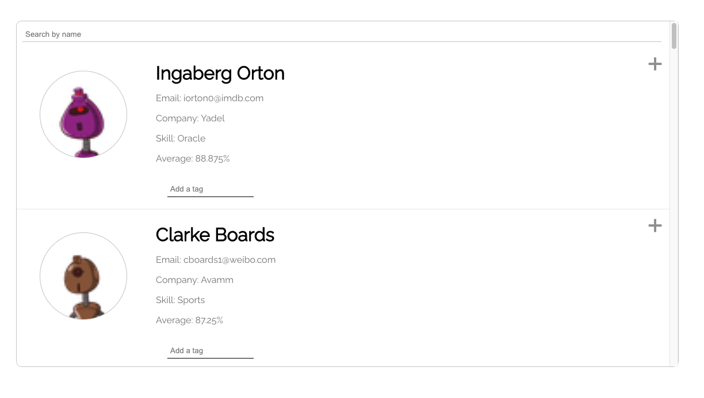
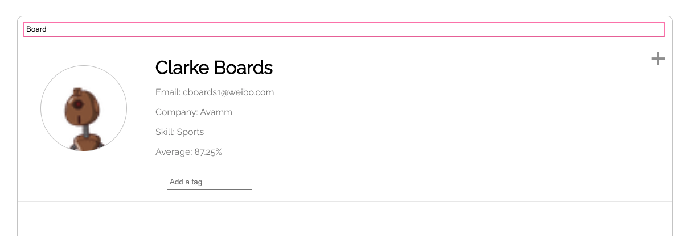
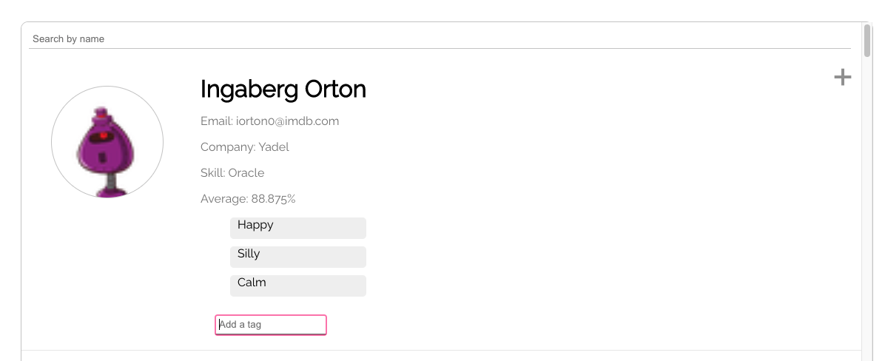

<h1 align="center">Student Profiles</h1>

<p align='center'>
    
    
    
</p>  

## Table of Contents
- [Description](#description)
- [Installation](#install)
- [Usage](#usage)

## Description
An application where you can view students, filter by student name, and add tags to each student.

## Install
If you would to use this application just clone the repo! Once cloned run the below command in the root of your folder! ---  

```
npm install
```

## Usage
### Once installed run:
```
npm start
```  
Page automatically opens or head to localhost:3000/
